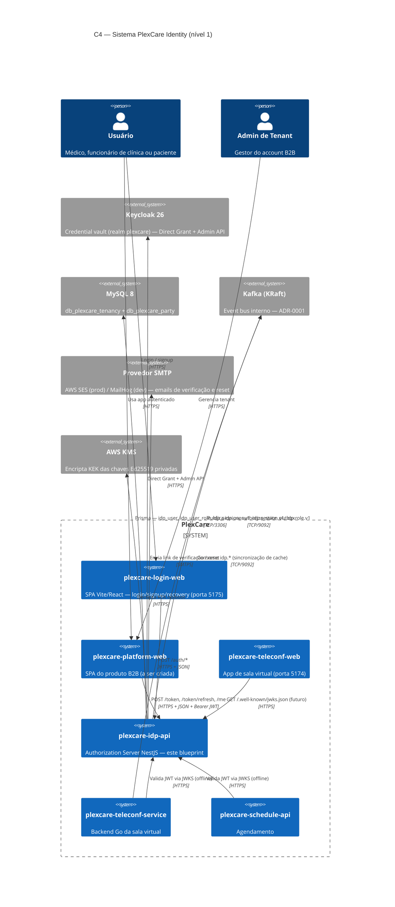
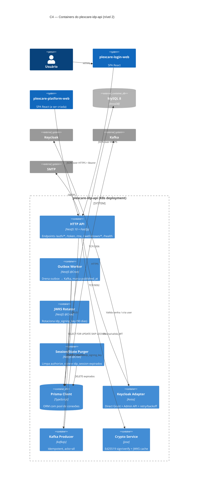
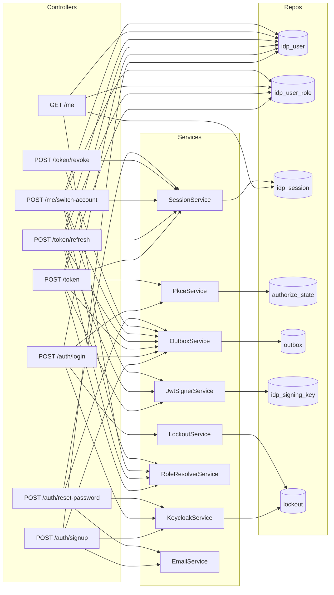
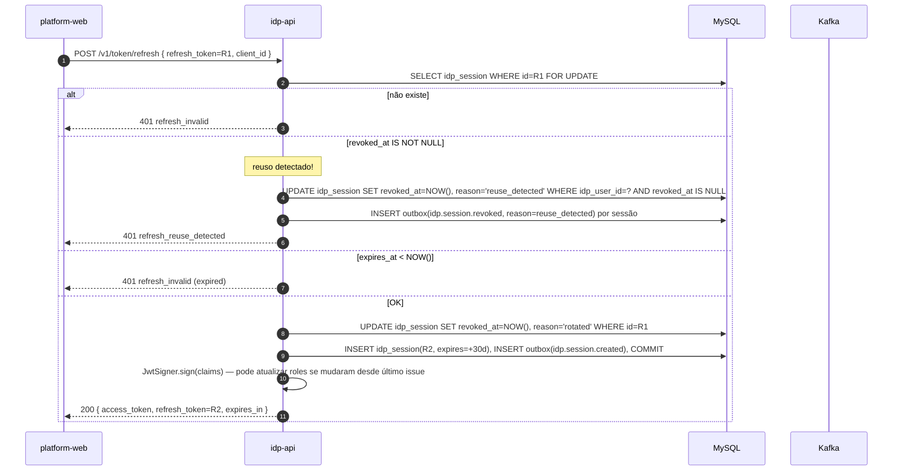
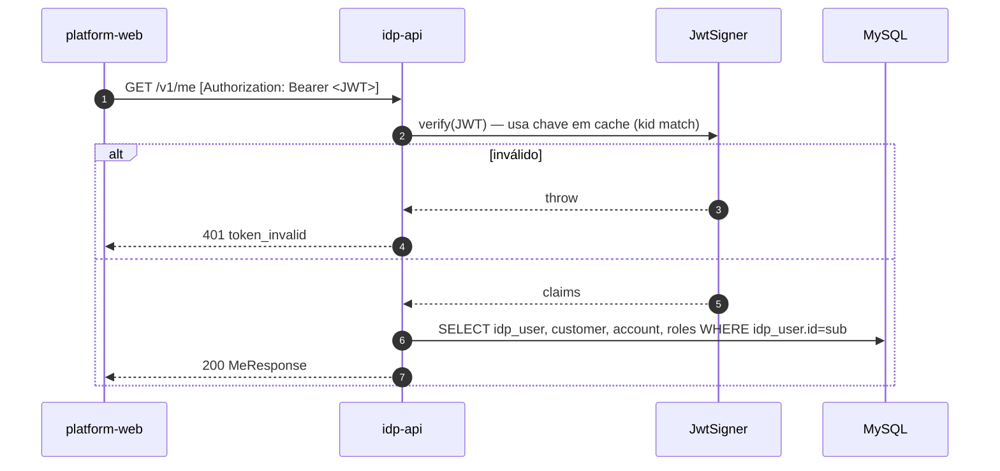
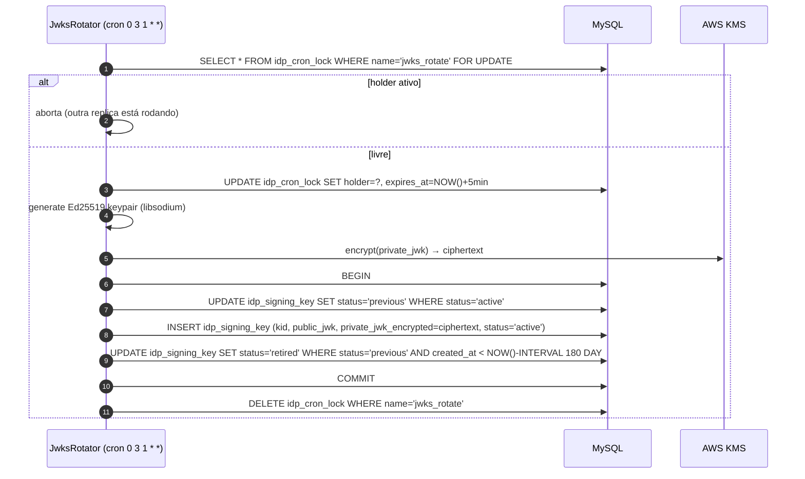
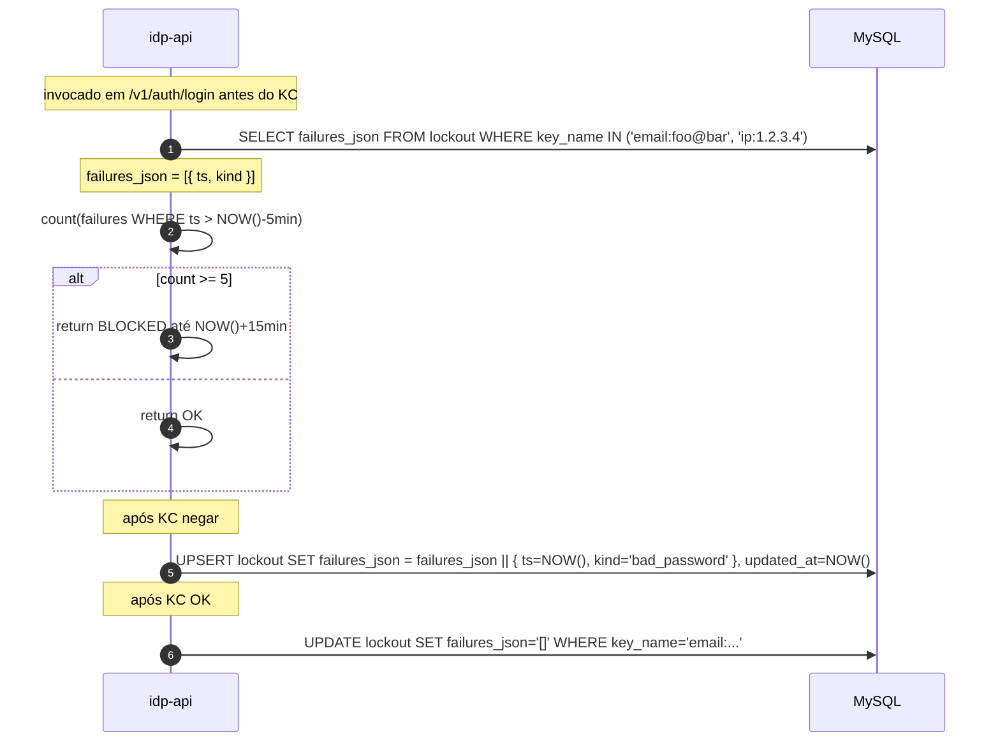

# Blueprint — `plexcare-idp-api`

> Etapa 2/6 do pipeline `/feature`. Estado: **blueprint pronto — aguardando `/spec`**.
> Entrada: [`idp-api-discovery.md`](./idp-api-discovery.md).
> Saída: este documento. Sem código — só desenho, contratos e diagramas.

---

## 0. Sumário executivo

`plexcare-idp-api` é o **Authorization Server** da PlexCare. É uma API REST stateless escrita em **NestJS 10 + Prisma + MySQL 8**, que:

- Atua como **OIDC Provider** próprio (emissor de JWT Ed25519, JWKS, refresh opaco)
- Usa **Keycloak** como _credential vault_ via Direct Grant — senha nunca toca o idp-api
- Faz **handoff PKCE-style** entre `plexcare-login-web` (auth UI) e `plexcare-platform-web` (app B2B)
- Persiste vínculo multi-tenant `keycloak_user_id ↔ customer ↔ account` e papéis (`doctor | employee | client | admin`)
- Publica eventos CloudEvents 1.0 via outbox → Kafka para consumers (`teleconf-service`, `schedule-api`, futuros)

**O que este blueprint resolve** das pendências de discovery:
- Componentes internos (módulos, serviços, repositórios) com responsabilidade explícita
- Contratos OpenAPI 3.1 completos de todos os endpoints
- Esquemas CloudEvents tipados por evento
- 12 sequence diagrams cobrindo fluxos felizes + falha
- Decisões abertas D-NÃO-TOMADAS do discovery (TTL, migration, error codes, SMTP, social)
- Trade-offs com pelo menos duas alternativas avaliadas

---

## 1. Contexto (C4 nível 1)

Ator humano interage só com SPAs. Toda comunicação com KC/Kafka/MySQL/SMTP é **server-to-server** a partir do idp-api.



**Quem consome o JWT do idp-api hoje?** `plexcare-platform-web` (front) e qualquer microserviço backend faz **validação offline** baixando o `/.well-known/jwks.json` (cache TTL 10 min). Nenhum microserviço chama `/introspect` em hot path.

**Quem NÃO está no diagrama:** o `site/` institucional (público, sem login), o `plexcare-teleconf-web` hoje (autorização de sala é via token efêmero LiveKit, _ainda_ desacoplado do idp-api; integração planejada em release subsequente).

---

## 2. Containers (C4 nível 2)



### 2.1 Por que 4 containers lógicos no mesmo deployment?

Embora rodem no **mesmo processo Node** (mesmo binário, mesmo container Docker), separamos logicamente porque:

| Container lógico | Pode falhar independentemente? | Escala separada? | Métrica isolada? |
|---|---|---|---|
| HTTP API | sim — degrada login | sim (HPA por CPU) | latência, RPS |
| Outbox Worker | sim — atrasa eventos | não no MVP, futuro `replicas=1` lock | `idp_outbox_lag_seconds` |
| JWKS Rotator | sim — chave nunca rota | não — singleton via lock | `idp_signing_key_age_days` |
| Session/State Purger | sim — DB cresce | não — singleton via lock | linhas removidas/min |

Os jobs cron precisam de **lock distribuído** quando `replicas > 1`. Decisão: usar `SELECT ... FOR UPDATE` em uma linha sentinela `idp_cron_lock(name, holder, expires_at)` (criada no `/spec`) — evita dependência de Redis no MVP.

---

## 3. Componentes (C4 nível 3) — interior do HTTP API

```mermaid
C4Component
    title C4 — Componentes do HTTP API (nível 3)

    Container_Boundary(api, "HTTP API NestJS") {
        Component(authMod, "AuthModule", "Controller + Service", "POST /auth/signup, /forgot, /reset, /change-password, /email/verify")
        Component(authzMod, "AuthorizeModule", "Controller + Service", "POST /auth/login → emite PKCE code")
        Component(tokenMod, "TokenModule", "Controller + Service", "POST /token, /token/refresh, /token/revoke")
        Component(meMod, "MeModule", "Controller + Service", "GET /me, /me/roles, /me/sessions; POST /me/switch-account")
        Component(jwksMod, "JwksModule", "Controller", "GET /.well-known/jwks.json + /.well-known/openid-configuration")
        Component(healthMod, "HealthModule", "Controller", "GET /health, /ready")

        Component(kcSvc, "KeycloakService", "Injectable", "Direct Grant, Admin createUser, sendVerificationEmail, resetCredentials")
        Component(jwtSigner, "JwtSignerService", "Injectable", "loadActiveKey(), sign(claims), verify(jwt), publishJwks()")
        Component(lockoutSvc, "LockoutService", "Injectable", "registerFailure(key), check(key) — janela 5 min / 5 fails")
        Component(pkceSvc, "PkceService", "Injectable", "createState(audience, challenge), consumeState(state) — usa authorize_state")
        Component(sessionSvc, "SessionService", "Injectable", "issueRefresh(user, client), rotateRefresh(refresh), revoke(refresh, reason)")
        Component(roleSvc, "RoleResolverService", "Injectable", "resolveActiveRole(user, requestedAccount) — escolhe role default ou a solicitada")
        Component(outboxSvc, "OutboxService", "Injectable", "publish(type, subject, data, tenantId) — INSERT na mesma TX do business write")
        Component(emailSvc, "EmailService", "Injectable", "sendVerification(email, token), sendReset(email, token) — template MJML")

        ComponentDb(repos, "Prisma Repositories", "TS", "IdpUserRepo, IdpUserRoleRepo, IdpSessionRepo, AuthorizeStateRepo, OutboxRepo, SigningKeyRepo, LockoutRepo")

        Component(guards, "Guards & Pipes", "Nest", "JwtAuthGuard, RolesGuard, ZodValidationPipe, RateLimitGuard")
        Component(filters, "Exception Filters", "Nest", "AppExceptionFilter → mapeia AppException → RFC 7807 problem+json")
        Component(interceptors, "Interceptors", "Nest", "OtelTracingInterceptor, PinoLoggingInterceptor, IdempotencyInterceptor")
    }

    Rel(authMod, kcSvc, "")
    Rel(authMod, repos, "")
    Rel(authMod, outboxSvc, "")
    Rel(authMod, emailSvc, "")

    Rel(authzMod, kcSvc, "")
    Rel(authzMod, lockoutSvc, "")
    Rel(authzMod, pkceSvc, "")
    Rel(authzMod, outboxSvc, "")

    Rel(tokenMod, pkceSvc, "")
    Rel(tokenMod, jwtSigner, "")
    Rel(tokenMod, sessionSvc, "")
    Rel(tokenMod, roleSvc, "")
    Rel(tokenMod, outboxSvc, "")

    Rel(meMod, repos, "")
    Rel(meMod, jwtSigner, "")
    Rel(meMod, sessionSvc, "")
    Rel(meMod, roleSvc, "")

    Rel(jwksMod, jwtSigner, "")
    Rel(healthMod, kcSvc, "")
    Rel(healthMod, repos, "")
```



### 3.1 Responsabilidade declarada de cada service (uma linha)

| Service | Responsabilidade única (SRP) | Não pertence aqui |
|---|---|---|
| `KeycloakService` | Adapter HTTP do KC (Direct Grant, Admin) | Decidir o que fazer com a resposta |
| `JwtSignerService` | Carregar chave ativa, assinar/validar JWT, expor JWKS | Definir claims de negócio |
| `LockoutService` | Contar falhas por chave, bloquear/desbloquear | Decidir o que conta como falha |
| `PkceService` | Gerar/consumir `authorize_state`, validar PKCE | Emitir tokens |
| `SessionService` | CRUD de `idp_session`, rotação atômica | Decidir reason= |
| `RoleResolverService` | Escolher papel ativo + montar claims `roles[]` | Persistir papéis |
| `OutboxService` | INSERT em outbox dentro da TX de negócio | Publicar (worker faz isso) |
| `EmailService` | Renderizar template + enfileirar envio SMTP | Conteúdo de domínio |

### 3.2 Mapa de chamadas (quem chama quem)



---

## 4. Contratos

### 4.1 Convenções gerais

- **Versionamento**: prefixo `/v1` em **todos** os endpoints de negócio. JWKS e well-known sem prefixo (padrão OIDC).
- **Content-type**: `application/json; charset=utf-8`. Erros em `application/problem+json` (RFC 7807).
- **Idempotência**: `Idempotency-Key` header em `POST /auth/signup`, `POST /token`, `POST /token/refresh`. Janela: 15 min, store: Redis (ou tabela `idempotency_key` no MVP — decisão em `/spec`).
- **Correlation**: `traceparent` (W3C) propagado; gera-se `X-Request-Id` se ausente.
- **Locale**: `Accept-Language` → mensagens de erro pt-BR/en-US.
- **Rate limiting** (em cima de `LockoutService` mas global): 60 req/min por IP em `/v1/auth/*`; 600 req/min em `/v1/me/*` (autenticado).
- **Schemas DTO**: validados por **Zod**, expostos no OpenAPI via `zod-to-openapi`.

### 4.2 Convenção de erros (decisão D-aberta resolvida)

Espelhar `AuthError.code` do `plexcare-login-web` — códigos estáveis legíveis em snake_case:

```json
{
  "type": "https://docs.plexcare.com/errors/login_invalid_credentials",
  "title": "Credenciais inválidas",
  "status": 401,
  "code": "login_invalid_credentials",
  "detail": "Email ou senha incorretos.",
  "instance": "/v1/auth/login",
  "trace_id": "0af7651916cd43dd8448eb211c80319c"
}
```

| `code` | HTTP | Quando |
|---|---|---|
| `signup_email_taken` | 409 | KC retorna user já existe |
| `signup_password_weak` | 422 | Falha em política OWASP L1 backend-side |
| `login_invalid_credentials` | 401 | Direct Grant 401 |
| `login_locked` | 423 | LockoutService bloqueado |
| `login_email_not_verified` | 403 | KC `email_verified=false` |
| `pkce_state_invalid` | 400 | state ausente/expirado/já consumido |
| `pkce_verifier_mismatch` | 400 | code_verifier não bate com challenge |
| `token_invalid` | 401 | JWT inválido/expirado |
| `refresh_invalid` | 401 | refresh inexistente/expirado/revogado |
| `refresh_reuse_detected` | 401 | refresh já rotacionado — revoga toda a família |
| `me_no_active_role` | 403 | usuário sem `idp_user_role` válido |
| `account_not_allowed` | 403 | switch-account para account onde não tem role |
| `email_verify_invalid` | 400 | token de verificação inválido/expirado |
| `reset_token_invalid` | 400 | token de reset inválido/expirado |
| `password_policy_violation` | 422 | nova senha fraca em change/reset |
| `rate_limited` | 429 | rate limit global excedido |
| `service_unavailable` | 503 | KC/MySQL/Kafka downstream falhou |

### 4.3 OpenAPI 3.1 — esqueleto consolidado

> Documento completo em YAML será materializado em `platform/backend/plexcare-idp-api/openapi.yaml` durante `/spec`. Abaixo, o **contrato canônico** que deve ser implementado, agrupado por capacidade.

#### 4.3.1 `POST /v1/auth/signup`

```yaml
post:
  operationId: signup
  summary: Cria nova conta de usuário no Keycloak + idp_user
  requestBody:
    required: true
    content:
      application/json:
        schema:
          $ref: '#/components/schemas/SignupRequest'
  responses:
    '202':
      description: Aceito; verificação por email enviada
      content:
        application/json:
          schema:
            $ref: '#/components/schemas/SignupAccepted'
    '409': { description: signup_email_taken,    $ref: '#/components/responses/Problem' }
    '422': { description: signup_password_weak,  $ref: '#/components/responses/Problem' }
    '429': { description: rate_limited,          $ref: '#/components/responses/Problem' }
    '503': { description: service_unavailable,   $ref: '#/components/responses/Problem' }

components:
  schemas:
    SignupRequest:
      type: object
      required: [email, password, full_name, customer_document, accept_terms]
      properties:
        email:              { type: string, format: email, maxLength: 255 }
        password:            { type: string, minLength: 12, maxLength: 128 }
        full_name:           { type: string, minLength: 2, maxLength: 200 }
        customer_document:   { type: string, description: "CPF (11) ou CNPJ (14) somente dígitos" }
        person_type:         { type: string, enum: [PF, PJ] }
        accept_terms:        { type: boolean, enum: [true] }
        client_id:           { type: string, description: "Origem do signup", example: "plexcare-login-web" }
    SignupAccepted:
      type: object
      properties:
        idp_user_id:         { type: string, format: uuid }
        verification_sent_to:{ type: string, format: email }
        message:             { type: string, example: "Enviamos um link de verificação para seu email." }
```

#### 4.3.2 `POST /v1/auth/login`

```yaml
post:
  operationId: login
  summary: Valida senha no Keycloak e emite código PKCE para handoff
  requestBody:
    required: true
    content:
      application/json:
        schema:
          $ref: '#/components/schemas/LoginRequest'
  responses:
    '200': { description: OK, content: { application/json: { schema: { $ref: '#/components/schemas/LoginResponse' } } } }
    '401': { description: login_invalid_credentials,     $ref: '#/components/responses/Problem' }
    '403': { description: login_email_not_verified,      $ref: '#/components/responses/Problem' }
    '423': { description: login_locked,                  $ref: '#/components/responses/Problem' }

components:
  schemas:
    LoginRequest:
      type: object
      required: [email, password, client_id, redirect_uri, code_challenge, code_challenge_method, state]
      properties:
        email:                 { type: string, format: email }
        password:              { type: string }
        client_id:             { type: string, enum: [plexcare-platform-web, plexcare-mobile, plexcare-login-web] }
        redirect_uri:          { type: string, format: uri }
        code_challenge:        { type: string, minLength: 43, maxLength: 128 }
        code_challenge_method: { type: string, enum: [S256] }
        state:                 { type: string, minLength: 16 }
        nonce:                 { type: string, nullable: true }
    LoginResponse:
      type: object
      required: [code, state, redirect_uri]
      properties:
        code:         { type: string, description: "authorization_code (32 bytes base64url)" }
        state:        { type: string }
        redirect_uri: { type: string, format: uri }
```

#### 4.3.3 `POST /v1/token`

```yaml
post:
  operationId: tokenExchange
  summary: Troca authorization_code por access_jwt + refresh + id_token
  requestBody:
    required: true
    content:
      application/json:
        schema:
          $ref: '#/components/schemas/TokenRequest'
  responses:
    '200': { description: OK, content: { application/json: { schema: { $ref: '#/components/schemas/TokenResponse' } } } }
    '400': { description: pkce_state_invalid OR pkce_verifier_mismatch, $ref: '#/components/responses/Problem' }
    '401': { description: token_invalid, $ref: '#/components/responses/Problem' }

components:
  schemas:
    TokenRequest:
      type: object
      required: [grant_type, code, code_verifier, client_id, redirect_uri]
      properties:
        grant_type:    { type: string, enum: [authorization_code] }
        code:          { type: string }
        code_verifier: { type: string, minLength: 43, maxLength: 128 }
        client_id:     { type: string }
        redirect_uri:  { type: string, format: uri }
        account_id:    { type: string, format: uuid, nullable: true, description: "Force account preference if user has multiple" }
    TokenResponse:
      type: object
      required: [access_token, refresh_token, id_token, token_type, expires_in, scope]
      properties:
        access_token:  { type: string, description: "JWT Ed25519 assinado" }
        refresh_token: { type: string, description: "UUID opaco" }
        id_token:      { type: string, description: "OIDC id_token (mesmo signer)" }
        token_type:    { type: string, enum: [Bearer] }
        expires_in:    { type: integer, example: 900 }
        scope:         { type: string, example: "openid profile email" }
```

**Claims do `access_token` (JWT)**:

```json
{
  "iss": "https://idp.plexcare.com.br",
  "sub": "<idp_user.id UUID>",
  "aud": ["plexcare-platform-web"],
  "exp": 1717440000,
  "iat": 1717439100,
  "nbf": 1717439100,
  "jti": "<UUID>",
  "client_id": "plexcare-platform-web",
  "account_id": "<account_id>",
  "account_customer_id": "<customer_id>",
  "active_role": "doctor",
  "roles": ["doctor", "employee"],
  "doctor_id": "<doctor_id?>",
  "client_id_party": null,
  "employee_id": null,
  "email": "felipe@clinic.com",
  "email_verified": true,
  "locale": "pt-BR"
}
```

**Claims do `id_token`**: mesmo subset + `nonce` (se enviado no `/login`), sem `roles[]` granulares — apenas `name`, `email`, `email_verified`, `sub`.

#### 4.3.4 `POST /v1/token/refresh`

```yaml
post:
  operationId: tokenRefresh
  summary: Rotaciona refresh_token; revoga o anterior; emite novo access_jwt
  requestBody:
    required: true
    content:
      application/json:
        schema:
          $ref: '#/components/schemas/RefreshRequest'
  responses:
    '200': { description: OK, content: { application/json: { schema: { $ref: '#/components/schemas/TokenResponse' } } } }
    '401': { description: refresh_invalid OR refresh_reuse_detected, $ref: '#/components/responses/Problem' }

components:
  schemas:
    RefreshRequest:
      type: object
      required: [grant_type, refresh_token, client_id]
      properties:
        grant_type:    { type: string, enum: [refresh_token] }
        refresh_token: { type: string, format: uuid }
        client_id:     { type: string }
```

#### 4.3.5 `POST /v1/token/revoke`

```yaml
post:
  operationId: tokenRevoke
  summary: Revoga refresh (logout)
  requestBody:
    content:
      application/json:
        schema:
          type: object
          required: [refresh_token]
          properties:
            refresh_token: { type: string, format: uuid }
            reason:        { type: string, enum: [logout, admin_revoke], default: logout }
  responses:
    '204': { description: Revogado (idempotente — devolve 204 mesmo se já estava revogado) }
```

#### 4.3.6 `/v1/auth/forgot-password`, `/v1/auth/reset-password`, `/v1/auth/change-password`, `/v1/auth/email/verify`

```yaml
/v1/auth/forgot-password:
  post:
    operationId: forgotPassword
    requestBody:
      content:
        application/json:
          schema:
            type: object
            required: [email]
            properties:
              email: { type: string, format: email }
    responses:
      '204': { description: "Resposta neutra — não confirma se conta existe" }

/v1/auth/reset-password:
  post:
    operationId: resetPassword
    requestBody:
      content:
        application/json:
          schema:
            type: object
            required: [reset_token, new_password]
            properties:
              reset_token:  { type: string }
              new_password: { type: string, minLength: 12 }
    responses:
      '204': { description: "Senha trocada; todas as sessões revogadas" }
      '400': { $ref: '#/components/responses/Problem' }  # reset_token_invalid
      '422': { $ref: '#/components/responses/Problem' }  # password_policy_violation

/v1/auth/change-password:
  post:
    security: [{ bearerAuth: [] }]
    operationId: changePassword
    requestBody:
      content:
        application/json:
          schema:
            type: object
            required: [current_password, new_password]
            properties:
              current_password: { type: string }
              new_password:     { type: string, minLength: 12 }
    responses:
      '204': { description: "Senha trocada; sessões _outras_ revogadas; sessão atual mantida" }
      '401': { $ref: '#/components/responses/Problem' }

/v1/auth/email/verify:
  post:
    operationId: verifyEmail
    requestBody:
      content:
        application/json:
          schema:
            type: object
            required: [verification_token]
            properties:
              verification_token: { type: string }
    responses:
      '200':
        content:
          application/json:
            schema:
              type: object
              properties:
                idp_user_id:    { type: string, format: uuid }
                email:          { type: string, format: email }
                email_verified: { type: boolean }
      '400': { $ref: '#/components/responses/Problem' }  # email_verify_invalid
```

#### 4.3.7 `/v1/me`, `/v1/me/roles`, `/v1/me/switch-account`, `/v1/me/sessions`

```yaml
/v1/me:
  get:
    security: [{ bearerAuth: [] }]
    operationId: meGet
    responses:
      '200':
        content:
          application/json:
            schema: { $ref: '#/components/schemas/MeResponse' }

/v1/me/roles:
  get:
    security: [{ bearerAuth: [] }]
    operationId: meRoles
    responses:
      '200':
        content:
          application/json:
            schema:
              type: array
              items: { $ref: '#/components/schemas/UserRole' }

/v1/me/switch-account:
  post:
    security: [{ bearerAuth: [] }]
    operationId: meSwitchAccount
    requestBody:
      content:
        application/json:
          schema:
            type: object
            required: [account_id]
            properties:
              account_id: { type: string, format: uuid }
              role:       { type: string, nullable: true, description: "Se múltiplas roles no mesmo account" }
    responses:
      '200':
        content:
          application/json:
            schema: { $ref: '#/components/schemas/TokenResponse' }
      '403': { $ref: '#/components/responses/Problem' }  # account_not_allowed

/v1/me/sessions:
  get:
    security: [{ bearerAuth: [] }]
    operationId: meSessions
    responses:
      '200':
        content:
          application/json:
            schema:
              type: array
              items: { $ref: '#/components/schemas/Session' }

/v1/me/sessions/{id}:
  delete:
    security: [{ bearerAuth: [] }]
    operationId: meRevokeSession
    parameters:
      - in: path
        name: id
        required: true
        schema: { type: string, format: uuid }
    responses:
      '204': { description: "Revogada (idempotente)" }

components:
  schemas:
    MeResponse:
      type: object
      required: [idp_user_id, email, email_verified, active_role, customer, account, roles]
      properties:
        idp_user_id:    { type: string, format: uuid }
        email:          { type: string, format: email }
        email_verified: { type: boolean }
        active_role:    { type: string }
        customer:
          type: object
          properties:
            id:        { type: string, format: uuid }
            full_name: { type: string }
            document:  { type: string }
        account:
          type: object
          properties:
            id:       { type: string, format: uuid }
            name:     { type: string }
        roles:
          type: array
          items: { $ref: '#/components/schemas/UserRole' }

    UserRole:
      type: object
      properties:
        account_id:   { type: string, format: uuid }
        account_name: { type: string }
        role:         { type: string, enum: [doctor, employee, client, admin] }
        doctor_id:    { type: string, format: uuid, nullable: true }
        client_id:    { type: string, format: uuid, nullable: true }
        employee_id:  { type: string, format: uuid, nullable: true }
        is_default:   { type: boolean }

    Session:
      type: object
      properties:
        id:           { type: string, format: uuid }
        client_id:    { type: string }
        user_agent:   { type: string }
        ip_address:   { type: string }
        created_at:   { type: string, format: date-time }
        last_used_at: { type: string, format: date-time }
        is_current:   { type: boolean }
```

#### 4.3.8 `/.well-known/jwks.json` e `/.well-known/openid-configuration`

```yaml
/.well-known/jwks.json:
  get:
    operationId: jwks
    description: "Cache-Control: public, max-age=600"
    responses:
      '200':
        content:
          application/json:
            schema:
              type: object
              required: [keys]
              properties:
                keys:
                  type: array
                  items:
                    type: object
                    properties:
                      kty: { type: string, enum: [OKP] }
                      crv: { type: string, enum: [Ed25519] }
                      x:   { type: string }
                      kid: { type: string }
                      use: { type: string, enum: [sig] }
                      alg: { type: string, enum: [EdDSA] }

/.well-known/openid-configuration:
  get:
    operationId: oidcDiscovery
    responses:
      '200':
        content:
          application/json:
            schema:
              type: object
              example:
                issuer: "https://idp.plexcare.com.br"
                authorization_endpoint: "https://login.plexcare.com.br/"
                token_endpoint: "https://idp.plexcare.com.br/v1/token"
                jwks_uri: "https://idp.plexcare.com.br/.well-known/jwks.json"
                userinfo_endpoint: "https://idp.plexcare.com.br/v1/me"
                response_types_supported: ["code"]
                grant_types_supported: ["authorization_code", "refresh_token"]
                code_challenge_methods_supported: ["S256"]
                id_token_signing_alg_values_supported: ["EdDSA"]
                token_endpoint_auth_methods_supported: ["none"]
                scopes_supported: ["openid", "profile", "email"]
                claims_supported: ["sub", "iss", "aud", "exp", "iat", "email", "email_verified", "account_id", "roles", "active_role", "doctor_id"]
```

#### 4.3.9 `/health` e `/ready`

```yaml
/health:
  get: { responses: { '200': { description: "process alive" } } }
/ready:
  get:
    responses:
      '200':
        description: "DB ok + KC ok"
        content:
          application/json:
            schema:
              type: object
              properties:
                mysql:    { type: string, enum: [ok, down] }
                keycloak: { type: string, enum: [ok, down] }
                kafka:    { type: string, enum: [ok, down, lagging] }
                signing_key_age_days: { type: integer }
      '503': { description: "Some dependency is down" }
```

### 4.4 Eventos CloudEvents 1.0 — payload tipado

Envelope conforme discovery. Tópicos e schemas de `data`:

#### Tópico `idp.user.v1`

```yaml
idp.user.signed_up:
  data:
    idp_user_id:         { type: string, format: uuid }
    keycloak_user_id:    { type: string, format: uuid }
    email:               { type: string, format: email }
    customer_document:   { type: string }
    person_type:         { type: string, enum: [PF, PJ] }
    signup_client_id:    { type: string }
    signup_ip:           { type: string }   # /24 mascarado em logs

idp.user.email_verified:
  data:
    idp_user_id:    { type: string, format: uuid }
    email:          { type: string, format: email }
    verified_at:    { type: string, format: date-time }

idp.user.password_changed:
  data:
    idp_user_id:    { type: string, format: uuid }
    reason:         { type: string, enum: [self_change, reset, admin_force] }
    changed_at:     { type: string, format: date-time }
```

#### Tópico `idp.session.v1`

```yaml
idp.session.created:
  data:
    session_id:     { type: string, format: uuid }
    idp_user_id:    { type: string, format: uuid }
    account_id:     { type: string, format: uuid }
    active_role:    { type: string }
    client_id:      { type: string }
    ip_address:     { type: string }
    user_agent:     { type: string }

idp.session.revoked:
  data:
    session_id:     { type: string, format: uuid }
    idp_user_id:    { type: string, format: uuid }
    reason:         { type: string, enum: [logout, password_changed, admin_revoke, reset, reuse_detected, expired] }
    revoked_at:     { type: string, format: date-time }

idp.session.login_failed:
  data:
    email_hash:     { type: string, description: "sha256(email)[0:16]" }
    ip_address:     { type: string }
    reason:         { type: string, enum: [bad_credentials, locked, email_not_verified, kc_down] }
    occurred_at:    { type: string, format: date-time }
```

#### Tópico `idp.role.v1`

```yaml
idp.role.assigned:
  data:
    idp_user_id: { type: string, format: uuid }
    account_id:  { type: string, format: uuid }
    role:        { type: string }
    doctor_id:   { type: string, nullable: true }
    assigned_by: { type: string, description: "idp_user_id do admin que atribuiu, ou 'system'" }

idp.role.revoked:
  data:
    idp_user_id: { type: string, format: uuid }
    account_id:  { type: string, format: uuid }
    role:        { type: string }
    revoked_by:  { type: string }
    reason:      { type: string }
```

**Partition key** em todos os eventos: `idp_user_id` — ordenação garantida por usuário (importante para sequências `signed_up → email_verified → session.created`).

### 4.5 Schema de DB — refinamentos sobre o discovery

Em adição às 3 novas tabelas (`idp_user_role`, `idp_session`, `idp_signing_key`), o blueprint **adiciona**:

```sql
-- Multi-cliente OIDC (R6 do discovery)
CREATE TABLE `idp_client` (
  `client_id`        VARCHAR(64)  NOT NULL,
  `name`             VARCHAR(255) NOT NULL,
  `audience`         VARCHAR(64)  NOT NULL,
  `redirect_uris`    JSON         NOT NULL,        -- array de strings
  `allowed_grants`   JSON         NOT NULL,        -- ["authorization_code","refresh_token"]
  `pkce_required`    TINYINT(1)   NOT NULL DEFAULT 1,
  `confidential`     TINYINT(1)   NOT NULL DEFAULT 0,
  `secret_hash`      VARCHAR(255) NULL,            -- argon2id se confidential=1
  `access_token_ttl_seconds`  INT NOT NULL DEFAULT 900,
  `refresh_token_ttl_seconds` INT NOT NULL DEFAULT 2592000,
  `created_at`       DATETIME(3) NOT NULL DEFAULT CURRENT_TIMESTAMP(3),
  PRIMARY KEY (`client_id`)
) ENGINE=InnoDB;

-- Lock distribuído para os jobs cron (substitui Redis no MVP)
CREATE TABLE `idp_cron_lock` (
  `name`       VARCHAR(64) NOT NULL,
  `holder`     VARCHAR(255) NULL,                  -- hostname + pid
  `expires_at` DATETIME(3) NOT NULL,
  PRIMARY KEY (`name`)
) ENGINE=InnoDB;

-- Idempotency (alternativa: Redis)
CREATE TABLE `idp_idempotency` (
  `key`         VARCHAR(128) NOT NULL,
  `route`       VARCHAR(128) NOT NULL,
  `response_status` SMALLINT NOT NULL,
  `response_body`   JSON     NULL,
  `created_at`  DATETIME(3) NOT NULL DEFAULT CURRENT_TIMESTAMP(3),
  `expires_at`  DATETIME(3) NOT NULL,
  PRIMARY KEY (`key`, `route`)
) ENGINE=InnoDB;
```

**TTLs definidos** (resposta a "decisões NÃO tomadas"):

| Token / artefato | TTL | Configurável? |
|---|---|---|
| `access_token` (JWT) | **15 min** (900s) | sim, por `idp_client.access_token_ttl_seconds` |
| `refresh_token` (idp_session) | **30 dias** (2.592.000s) | sim, por `idp_client.refresh_token_ttl_seconds` |
| `authorize_state` (PKCE code) | **5 min** | env `PKCE_STATE_TTL_SECONDS` |
| `reset_token` | **30 min** | env `RESET_TOKEN_TTL_SECONDS` |
| `verification_token` | **24h** | env `EMAIL_VERIFY_TTL_SECONDS` |
| `idempotency_key` | **15 min** | env |
| `jwks` (CDN cache) | **10 min** | header `Cache-Control` |
| `idp_signing_key.active` rotação | **90 dias** | cron mensal |

---

## 5. Sequence diagrams

### 5.1 Signup completo (login-web → idp-api → KC → SMTP)

```mermaid
sequenceDiagram
    autonumber
    actor U as Usuário
    participant LW as login-web
    participant API as idp-api
    participant KC as Keycloak
    participant DB as MySQL
    participant SMTP
    participant K as Kafka

    U->>LW: preenche signup form
    LW->>API: POST /v1/auth/signup { email, password, full_name, doc }
    API->>API: Zod validate + senha L1 + doc CPF/CNPJ
    API->>KC: Admin API → POST /users (email_verified=false, enabled=true)
    alt email já existe
        KC-->>API: 409
        API-->>LW: 409 signup_email_taken
    else criado
        KC-->>API: 201 { id: kc_user_id }
        API->>KC: Admin API → PUT /users/{id}/reset-password (temporary=false)
        KC-->>API: 204
        API->>DB: BEGIN; INSERT customer + idp_user(kc_user_id); INSERT outbox(idp.user.signed_up); COMMIT
        API->>KC: Admin API → PUT /users/{id}/execute-actions-email (VERIFY_EMAIL)
        KC->>SMTP: Envia email (com link → callback no idp-api)
        API-->>LW: 202 { idp_user_id, verification_sent_to }
        Note over API,K: Worker outbox publica idp.user.signed_up
    end
```

**Falhas:**
- KC down → `503 service_unavailable`; **nada persistido** (writes só após KC sucesso).
- DB falha após KC sucesso → **compensação assíncrona**: job reconcilia `kc_user_id` órfãos (deleta no KC após 5 min sem `idp_user`).

### 5.2 Login + handoff PKCE (3-party: login-web ↔ idp-api ↔ platform-web)

```mermaid
sequenceDiagram
    autonumber
    actor U as Usuário
    participant LW as login-web
    participant API as idp-api
    participant KC as Keycloak
    participant DB as MySQL
    participant PW as platform-web

    U->>LW: digita email+senha
    LW->>LW: gera code_verifier (random 43-128) + code_challenge=S256(verifier) + state
    LW->>LW: armazena code_verifier em sessionStorage
    LW->>API: POST /v1/auth/login { email, password, code_challenge, state, client_id, redirect_uri }
    API->>API: LockoutService.check(email, ip)
    alt bloqueado
        API-->>LW: 423 login_locked
    else
        API->>KC: POST /realms/plexcare/protocol/openid-connect/token (grant=password)
        alt KC 401
            API->>DB: LockoutService.registerFailure
            API->>DB: outbox(idp.session.login_failed)
            API-->>LW: 401 login_invalid_credentials
        else KC 200 (mas email_verified=false)
            API-->>LW: 403 login_email_not_verified
        else KC 200 OK
            API->>DB: BEGIN; INSERT authorize_state(state, challenge, redirect_uri, expires=+5min); COMMIT
            API->>DB: LockoutService.reset(email, ip)
            API-->>LW: 200 { code, state, redirect_uri }
        end
    end
    LW->>U: window.location.assign(redirect_uri?code=X&state=Y)
    U->>PW: navega para /callback?code=X&state=Y
    PW->>PW: lê code_verifier do sessionStorage (set em LW via subdomínio compartilhado OU postMessage OU re-prompt)
    Note over LW,PW: cross-origin → usar STORAGE bridge dedicada documentada em ADR de sessão
    PW->>API: POST /v1/token { grant_type=code, code, code_verifier, client_id, redirect_uri }
    API->>DB: SELECT authorize_state WHERE state=? FOR UPDATE
    alt state inválido / expirado / consumido
        API-->>PW: 400 pkce_state_invalid
    else
        API->>API: verify SHA256(code_verifier) == challenge
        alt mismatch
            API-->>PW: 400 pkce_verifier_mismatch
        else OK
            API->>DB: DELETE authorize_state (single-use)
            API->>DB: SELECT idp_user + idp_user_role + customer + account
            API->>API: RoleResolver.resolveActive(user, account_id?)
            API->>API: JwtSigner.sign(claims)
            API->>DB: BEGIN; INSERT idp_session(refresh, user, client, expires=+30d); INSERT outbox(idp.session.created); COMMIT
            API-->>PW: 200 { access_token, refresh_token, id_token, expires_in }
            PW->>PW: armazena access_token em memória + refresh em httpOnly Secure SameSite=Strict cookie
            PW->>U: renderiza dashboard
        end
    end
```

**Cross-origin bridge** entre `login-web` e `platform-web`: como ambos estão em `*.plexcare.com.br`, o `code_verifier` é armazenado em `sessionStorage` na origem comum **`auth.plexcare.com.br`** que ambas SPAs carregam via `<iframe>` invisível ou via cookie `__Host-pkce-verifier` (`SameSite=Lax`, `Secure`, `Path=/`, `HttpOnly=false` para acesso JS). Decisão final em `/spec` após confirmar topologia DNS.

### 5.3 Refresh token (rotação + detecção de reuso)



**Detecção de reuso** segue OAuth 2.1 §6.1 — qualquer refresh já rotacionado invalida **toda a família** de sessões do usuário no mesmo `client_id`.

### 5.4 Logout (revoke)

```mermaid
sequenceDiagram
    autonumber
    participant PW as platform-web
    participant API as idp-api
    participant DB as MySQL
    participant K as Kafka

    PW->>API: POST /v1/token/revoke { refresh_token=R }
    API->>DB: UPDATE idp_session SET revoked_at=NOW(), reason='logout' WHERE id=R AND revoked_at IS NULL
    API->>DB: INSERT outbox(idp.session.revoked, reason=logout) — só se UPDATE afetou 1 linha
    API-->>PW: 204
    Note over PW: limpa refresh cookie + access em memória; redirect /login
```

**Idempotência**: 204 mesmo se já estava revogado. O `INSERT outbox` é condicional ao `affected_rows = 1` para evitar evento duplicado.

### 5.5 `/v1/me` (validação JWT + lookup)



**Cache**: `JwtSigner.verify` carrega `idp_signing_key` na boot e refresha a cada 1 min. Tokens com `kid` desconhecido → 401 (não bypassa).

### 5.6 Switch account (re-emite token com outro tenant)

```mermaid
sequenceDiagram
    autonumber
    participant PW as platform-web
    participant API as idp-api
    participant DB as MySQL

    PW->>API: POST /v1/me/switch-account { account_id=A2, role?='doctor' }  [Bearer]
    API->>API: verify JWT
    API->>DB: SELECT idp_user_role WHERE idp_user_id=? AND account_id=A2 AND revoked_at IS NULL
    alt nenhum
        API-->>PW: 403 account_not_allowed
    else
        API->>API: RoleResolver — pick requested or first
        API->>API: JwtSigner.sign(new claims with account_id=A2, active_role=...)
        API->>DB: BEGIN; UPDATE idp_session SET revoked_at=NOW() WHERE id=current_refresh; INSERT idp_session(R_new); INSERT outbox(session.revoked) + outbox(session.created); COMMIT
        API-->>PW: 200 { access_token, refresh_token=R_new }
    end
```

### 5.7 Forgot password (resposta neutra)

```mermaid
sequenceDiagram
    autonumber
    actor U as Usuário
    participant LW as login-web
    participant API as idp-api
    participant DB as MySQL
    participant KC as Keycloak
    participant SMTP

    U->>LW: clica "esqueci senha"; digita email
    LW->>API: POST /v1/auth/forgot-password { email }
    API->>API: rate-limit + timing budget mínimo (300ms) para não vazar existência
    API->>DB: SELECT idp_user WHERE login=email
    alt existe
        API->>KC: Admin API → PUT /users/{id}/execute-actions-email (UPDATE_PASSWORD)
        KC->>SMTP: envia link
        API->>DB: outbox(idp.user.password_reset_requested) [opcional, low-importance]
    else não existe
        Note over API: sleep até completar 300ms
    end
    API-->>LW: 204 (sempre)
```

### 5.8 Reset password (consumo do link)

```mermaid
sequenceDiagram
    autonumber
    actor U as Usuário
    participant LW as login-web
    participant API as idp-api
    participant KC as Keycloak
    participant DB as MySQL

    U->>LW: abre link de reset (?reset_token=T) — link aponta para login-web
    LW->>U: form nova senha
    U->>LW: nova senha
    LW->>API: POST /v1/auth/reset-password { reset_token=T, new_password }
    API->>KC: Admin API → POST /authentication/reset-credentials (T) — KC valida token
    alt KC erro
        API-->>LW: 400 reset_token_invalid
    else KC OK
        API->>KC: Admin API → PUT /users/{id}/reset-password (new_password)
        KC-->>API: 204
        API->>DB: BEGIN; UPDATE idp_session SET revoked_at=NOW(), reason='reset' WHERE idp_user_id=? AND revoked_at IS NULL
        API->>DB: INSERT outbox(idp.user.password_changed, reason=reset) + outbox(idp.session.revoked × N); COMMIT
        API-->>LW: 204
    end
```

> **Nota implementação**: o link de reset emitido pelo Keycloak hoje aponta para o **realm**. Para que a UX abra no login-web, configuramos `redirectUri` na chamada `execute-actions-email` apontando para `https://login.plexcare.com.br/reset?token={KEYCLOAK_TOKEN}`. O login-web só repassa o token para o idp-api — **nunca chama o Keycloak diretamente**.

### 5.9 Email verification

```mermaid
sequenceDiagram
    autonumber
    actor U as Usuário
    participant Email
    participant LW as login-web
    participant API as idp-api
    participant KC as Keycloak
    participant DB as MySQL

    Email->>U: link "verifique seu email"
    U->>LW: abre /verify?token=V
    LW->>API: POST /v1/auth/email/verify { verification_token=V }
    API->>KC: POST /realms/plexcare/login-actions/action-token (V)
    alt KC valida e marca email_verified=true
        KC-->>API: 200
        API->>DB: SELECT idp_user; INSERT outbox(idp.user.email_verified); COMMIT
        API-->>LW: 200 { idp_user_id, email, email_verified: true }
    else inválido
        API-->>LW: 400 email_verify_invalid
    end
```

### 5.10 Outbox worker (drena para Kafka)

```mermaid
sequenceDiagram
    autonumber
    participant W as Outbox Worker
    participant DB as MySQL
    participant K as Kafka

    loop a cada 500ms (ou ~1k linhas pendentes)
        W->>DB: BEGIN
        W->>DB: SELECT id, type, subject, data, tenant_id FROM outbox WHERE published_at IS NULL ORDER BY id LIMIT 100 FOR UPDATE SKIP LOCKED
        alt vazio
            W->>DB: COMMIT (no-op)
        else N linhas
            W->>K: produce batch (idempotent, acks=all, headers ce-*)
            alt produce OK
                W->>DB: UPDATE outbox SET published_at=NOW() WHERE id IN (...); COMMIT
            else produce falhou
                W->>DB: UPDATE outbox SET attempts=attempts+1, last_error=? WHERE id IN (...); COMMIT
                Note over W: backoff exponencial: 1s, 5s, 30s, max 5min
            end
        end
    end
```

**Garantia**: at-least-once. Consumers devem ser idempotentes pelo `event_id` (já é `UNIQUE` no schema).

### 5.11 JWKS rotation (cron mensal)



**Visibilidade**: `/.well-known/jwks.json` retorna `keys[]` com **active + previous** (não retired). Garante grace period de 90 dias para tokens ainda em circulação.

### 5.12 Lockout (anti-bruteforce)



---

## 6. Trade-offs considerados

### TO-1. **Issuer próprio (NestJS)** vs. **delegar ao Keycloak (KC público)**

| Opção | Como funciona | Pró | Contra |
|---|---|---|---|
| **Escolhida — IdP próprio + KC oculto** | Cliente fala só com idp-api; KC só por Direct Grant server-side. JWT é emitido pelo Nest com Ed25519 próprio. | UX customizada; claims `account_id/roles` embutidos; KC escondível (segurança); evolução independente | Mais código próprio; necessidade de testes de segurança rigorosos |
| Delegar ao KC (público) | login-web faz redirect direto pro KC; consome `id_token` do KC; idp-api só pra `/me/roles` etc. | Menos código; menos superfície de bug em emissão de token; KC bem testado | UX presa ao tema KC; claims customizados via mappers KC (pouco flexível); KC público = mais superfície de ataque; cada SPA vira "client" no KC com flow OAuth completo |
| KC + custom Authenticator SPI | Mantém KC como issuer mas pluga código Java no KC pra fazer enriching | Aproveita JWKS do KC | Time NestJS não escreve Java; SPI = lock-in; CI/CD KC mais lento; deploy crítico |

**Justificativa**: a discovery (D1, D5) já fechou IdP próprio. O blueprint reconfirma — risco R1 (divergência Go/Nest) é menor que o risco de UX presa ao KC ou Java SPI.

### TO-2. **Refresh opaco em DB** vs. **Refresh como JWT** vs. **Sessão em cookie HttpOnly**

| Opção | Mecanismo | Pró | Contra |
|---|---|---|---|
| **Escolhida — Refresh opaco UUID em `idp_session`** | Cliente armazena UUID; idp-api consulta DB em cada refresh | Revogação imediata (DELETE/UPDATE); reuso detectável; lista de sessões fácil | DB hit por refresh (~15min); +1 dependência |
| Refresh como JWT (também Ed25519) | Cliente armazena JWT longo; idp-api só valida assinatura | Stateless; sem DB hit | Revogação só com blocklist (igual DB); reuso muito mais difícil de detectar; rotação obriga blocklist mesmo assim |
| Sessão server-side em cookie HttpOnly | Cliente nunca toca token; cookie + DB session | Mais simples no front; XSS proof | Não funciona com mobile nativo; CSRF a mitigar; cross-domain doloroso |

**Justificativa**: refresh opaco maximiza segurança (rotação + reuse detection) com custo de 1 query MySQL por refresh, que é < 5ms em índice PK. Funciona em web e mobile. Cookie HttpOnly fica para o **access_token storage** no front (decisão da SPA).

### TO-3. **PKCE handoff via authorize_state** vs. **iframe silent auth** vs. **postMessage entre subdomínios**

| Opção | Como move `code_verifier` entre origens | Pró | Contra |
|---|---|---|---|
| **Escolhida — PKCE state + cookie `__Host-pkce-verifier` em apex** | login-web grava cookie no apex `plexcare.com.br`; platform-web lê | Stateless no idp-api (state na tabela já é necessário); funciona em subdomínio | Apex cookie share — exige Secure+Lax; documentação clara obrigatória |
| iframe silent auth (OIDC) | platform-web monta `<iframe src="idp-api/authorize">` invisível pós-login | Padrão OIDC consagrado | Não cobre o caso "vim do login-web direto" sem sessão prévia no idp |
| postMessage entre janelas | login-web `window.opener.postMessage(verifier)` | Funciona cross-domain real | UX exige popup; bloqueado por adblockers; difícil em mobile webview |

**Justificativa**: ambas SPAs vivem sob `*.plexcare.com.br`, então cookie no apex é a opção mais simples e segura. Detalhes finais (nome exato do cookie, samesite policy) ficam no `/spec`.

### TO-4. **Outbox + worker poll** vs. **Outbox + Debezium CDC** vs. **Publicar direto na transação**

| Opção | Como evento chega ao Kafka | Pró | Contra |
|---|---|---|---|
| **Escolhida — Outbox + worker poll** | Worker faz SELECT ... FOR UPDATE SKIP LOCKED e produz | Sem dependência de infra adicional; baixa latência (~500ms); fácil de raciocinar | Worker é SPOF (mitigado com lock + replicas=1) |
| Outbox + Debezium CDC | Kafka Connect lê binlog do MySQL | Latência ainda menor (~ms); zero código de worker | Operacional pesado (Debezium + Connect cluster); overkill MVP |
| Publicar direto na TX | Service.x() faz INSERT no DB + produce Kafka na mesma função | Sem outbox | Quebra at-least-once; perde eventos se Kafka cair entre commit DB e produce |

**Justificativa**: ADR-0001 já elegeu Kafka como bus; outbox + poll é o caminho idiomático e está alinhado ao discovery (D6). Debezium fica como evolução se latência <500ms virar requisito.

### TO-5. **MySQL 8** vs. **PostgreSQL 16** vs. **manter MySQL e PG em domínios diferentes**

| Opção | Como persistir IdP | Pró | Contra |
|---|---|---|---|
| **Escolhida — MySQL 8** | Schema atual `db_plexcare_tenancy` já em MySQL | Coerência com schema legado (account, customer); zero migration | `teleconf-service` Go usa PG → 2 DBs no estado final; Prisma + MySQL JSON é mais limitado que PG |
| PostgreSQL 16 | Migrar tabelas IdP para PG | Tipos ricos (JSONB, arrays); PgPool; LISTEN/NOTIFY para outbox | Migrar `idp_user`, `authorize_state` etc. já populados; quebrar FKs com `account/customer` |
| Manter dual (legado MySQL + novos PG) | IdP no PG, junção lógica por UUID | Cada serviço escolhe seu banco | Tracing cross-DB; backup/restore complexo |

**Justificativa**: MySQL — minimiza migração; FKs com `account/customer` preservadas. Prisma cobre bem. Reavaliar em ADR futura se PG virar necessário.

### TO-6. **NestJS modular clássico** vs. **NestJS + hexagonal (alinhado com Go)** vs. **Fastify puro**

| Opção | Estilo de código | Pró | Contra |
|---|---|---|---|
| **Escolhida — NestJS modular clássico** (D7) | Controller → Service → Repo | DX rápido; documentação enorme; convenção do time JS | Diverge do hexagonal Go; risco R1 |
| NestJS modular + hexagonal | `domain/`, `application/`, `infrastructure/` dentro de cada módulo | Paridade com Go; testabilidade alta | Onboarding inicial mais lento para time JS; duplica boilerplate |
| Fastify puro + manual DI | Sem framework | Menos overhead; rápido | Time perde NestJS toolkit (Pipes, Guards, OpenAPI); mais código próprio |

**Justificativa**: discovery fechou D7. Blueprint reafirma com **mitigação de R1**: convencionar `service` = camada `application` e `repos` = `infrastructure`; deixar `domain/` (entidades + value objects + erros) explícito por módulo. Compromisso: hexagonal "lite" — pasta `domain/` separada, mas sem `ports/` formais até o primeiro caso de troca de adapter.

### TO-7. **Email provider** (R5 do discovery)

| Opção | Stack | Pró | Contra |
|---|---|---|---|
| **Escolhida — AWS SES (prod) + MailHog (dev)** | SDK + SMTP | Coerente com AWS na stack; barato; SPF/DKIM/DMARC fáceis | Sandbox SES até warm-up (200 emails/dia inicialmente) |
| Postmark | API HTTP | Deliverability top de linha; templates excelentes | Custo (~$15/mês mínimo) |
| Mailgun | API HTTP / SMTP | Webhooks ricos; templates | Stack extra não-AWS |

**Justificativa**: AWS SES está alinhada com a Conta AWS já em uso e o time DevOps. Em dev, MailHog (já em compose). KC envia via SMTP relay → idp-api configura KC SMTP server = SES SMTP endpoint.

---

## 7. Pontos de extensão (futuro)

Pontos onde o blueprint **deixa hooks** para evolução sem quebrar contratos:

| # | Capability futura | Hook desenhado hoje |
|---|---|---|
| EXT-1 | **MFA TOTP/WebAuthn** (R7) | `LoginResponse` poderá retornar `mfa_required: true, mfa_challenge: "..."` antes do `code`; novo endpoint `POST /v1/auth/mfa/verify`. `idp_user.mfa_secret_encrypted` opcional. |
| EXT-2 | **Social login** (R8) | `idp_user.federated_idp: 'google' \| 'apple' \| 'kc-local'`; `POST /v1/auth/oauth/callback?provider=google` cobre o callback do KC. `idp_client.allowed_grants` ganha `oauth_federated`. |
| EXT-3 | **mTLS client confidential** | `idp_client.confidential=1` + `client_certificate_thumbprint`; valida em `POST /v1/token` via `X-Client-Cert-Thumbprint` (Ingress). |
| EXT-4 | **Audit log dedicado** (LGPD inquéritos) | Tabela `idp_audit_log` ou consumer Kafka que materializa eventos `idp.*` em DB read-optimized; idp-api publica eventos com `subject=idp_user/<id>` já compatível. |
| EXT-5 | **Token introspection** (RFC 7662) | Endpoint `POST /v1/introspect` sob basic-auth de `idp_client.secret_hash`. JWT decoder local já existe; só rotear. |
| EXT-6 | **Device authorization grant** (CLI / TV) | Novo endpoint `POST /v1/device/code`, `POST /v1/device/verify`, `POST /v1/token` (grant_type=urn:ietf:params:oauth:grant-type:device_code). Tabela `idp_device_code` separada. |
| EXT-7 | **Política RBAC além de roles[]** | `RoleResolverService` já produz claim `roles[]`. Adicionar `permissions[]` resolvendo de `role → permission` em tabela `idp_role_permission`. Microserviços continuam validando offline via JWKS. |
| EXT-8 | **Pluggable credential vault** (sair do KC) | `KeycloakService` é o único acoplamento; refatorar para interface `CredentialVault { verifyPassword(), createUser(), ... }` (TO-1 alternativo). Risco R2 endereçado. |
| EXT-9 | **WebAuthn passkey-only signup** | `POST /v1/auth/signup/passkey/options` + `POST /v1/auth/signup/passkey/verify`; senha vira opcional em `idp_user`. KC suporta nativamente desde 24. |
| EXT-10 | **Multi-realm / white-label** | `idp_client.realm` + adapter KC parametrizado por realm; cada tenant pode ter seu KC realm de SSO. |

---

## 8. Dependências externas — matriz de prontidão

| Dependência | Provisionada? | Bloqueante para MVP? | Owner | Quando |
|---|---|---|---|---|
| **Keycloak 26 + realm `plexcare`** | ✅ sim (já rodando em dev) | sim | DevOps | já |
| **MySQL 8 `db_plexcare_tenancy`** | ✅ sim, schema parcial | sim | Backend | migration `idp_user_role`, `idp_session`, `idp_signing_key`, `idp_client`, `idp_cron_lock`, `idp_idempotency` em `/spec` |
| **Kafka tópicos `idp.user.v1`, `idp.session.v1`, `idp.role.v1`** | ❌ não | sim | DevOps | criar (3 partições, replication 3 em prod) |
| **`plexcare-login-web`** | ✅ sim, rodando 5175 | sim | Frontend | OK |
| **`plexcare-platform-web`** | ❌ existe pasta vazia | **não** para v1 do idp-api isoladamente; sim para fluxo end-to-end | Frontend | scaffold em paralelo |
| **AWS SES (prod)** | ❌ não | em prod sim | DevOps | configurar pré-release |
| **MailHog (dev)** | ⚠️ adicionar ao compose | dev sim | Backend | `/spec` |
| **AWS KMS (KEK)** | ❌ não | em prod sim | DevOps | criar key, IAM role para idp-api |
| **Prisma + driver MySQL** | n/a (escolhido) | n/a | Backend | `/spec` |
| **DNS `idp.plexcare.com.br`** | ❌ não | prod sim | DevOps | pré-release |

---

## 9. Reconciliação com riscos do discovery

| Risco | Endereçado neste blueprint | Como |
|---|---|---|
| R1 — hexagonal vs modular | parcialmente | TO-6 — hexagonal "lite": pasta `domain/` separada por módulo |
| R2 — lock-in KC | parcialmente | EXT-8 — `KeycloakService` isolável atrás de interface no futuro |
| R3 — rotação chave única em prod | sim | §5.11 — cron mensal + KMS para KEK + estado `previous` 90 dias |
| R4 — platform-web inexistente | parcialmente | §5.2 — bridge desenhada; `/spec` materializa, mas idp-api pode subir e ser testado e2e antes |
| R5 — SMTP provider | sim | TO-7 — AWS SES + MailHog |
| R6 — `idp_client` table | sim | §4.5 — DDL incluído |
| R7 — MFA fora de escopo | sim | EXT-1 — hook desenhado, não implementado |
| R8 — social login | parcialmente | EXT-2 — hook desenhado; fluxo completo em discovery futuro |

---

## 10. Checkpoint /feature

- [x] `/discovery` concluído (`idp-api-discovery.md`)
- [x] `/blueprint` — **este documento**
- [ ] `/spec` — pendente (próximo)
- [ ] `/tdd`
- [ ] `/review`
- [ ] `/qa`

### O que `/spec` deve materializar

1. **Schema Prisma completo** (`schema.prisma`) + primeira migration SQL (incluindo `idp_client`, `idp_cron_lock`, `idp_idempotency`)
2. **`openapi.yaml`** completo (extrair os esqueletos da §4.3 em um único arquivo válido)
3. **Estrutura de pastas final** com `domain/` por módulo (TO-6 mitigação)
4. **`.env.example`** com todas as envs (TTLs, KC URL, Kafka brokers, SMTP, KMS)
5. **`docker-compose.dev.yml`** delta (MySQL 8 + MailHog se ainda não estão)
6. **Lista de casos de teste TDD prioritários** (lockout, PKCE, refresh rotation+reuse, JWT claims, outbox atomicity)
7. **ADR-0004 — IdP próprio + KC oculto** (consolida TO-1 + TO-3)
8. **ADR-0005 — Outbox + worker poll** (consolida TO-4, embora ADR-0001 já cubra Kafka)
9. **Decisão final do bridge PKCE** entre login-web e platform-web (cookie apex vs alternativa)

> Para retomar: `/clear` e executar `/spec` carregando **este blueprint** + `idp-api-discovery.md` como contexto.
